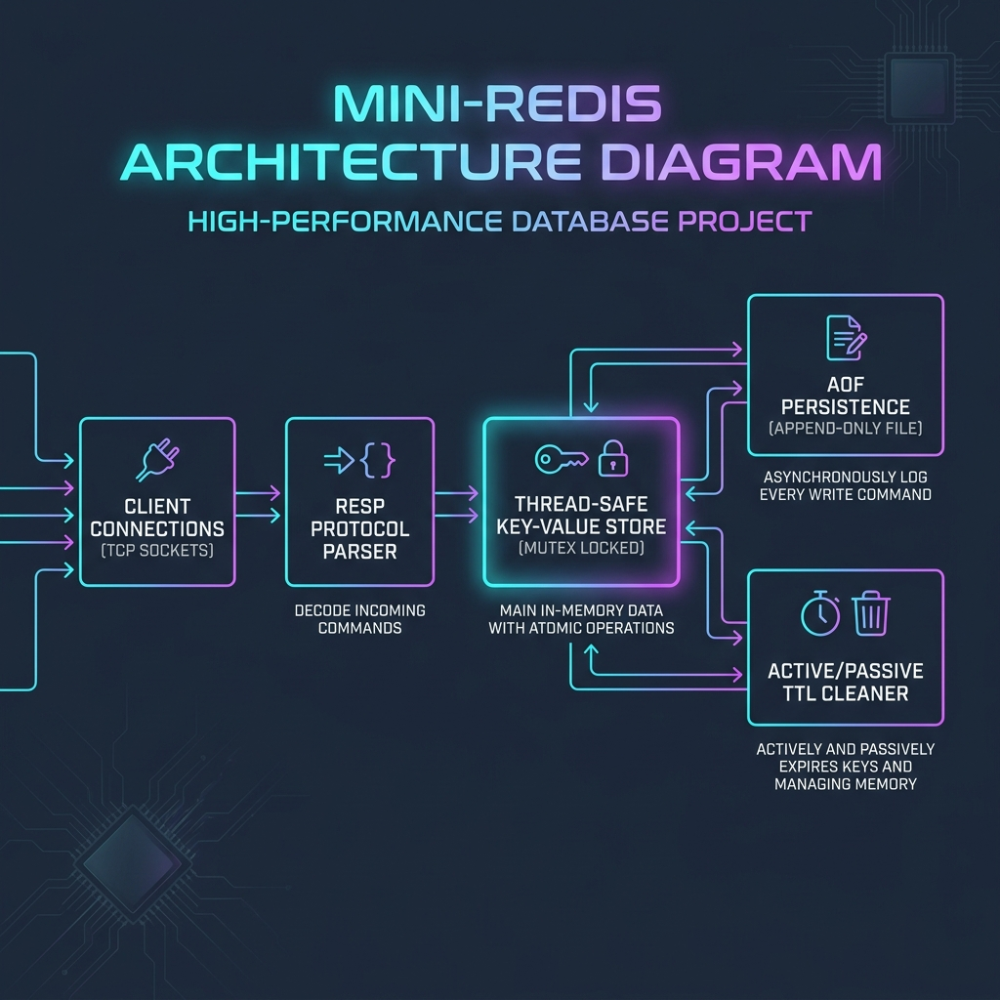
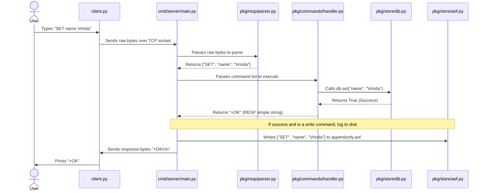

# Mini-Redis 🚀

A lightweight, high-performance in-memory key-value database clone of Redis, written completely from scratch in Python. 



This project was built to understand systems programming, networking, custom protocol parsing, thread safety, and database durability.

---

## Features
- **TCP Socket Server:** Multi-threaded TCP server supporting concurrent connections on the standard Redis port (`6379`).
- **RESP Protocol Parser:** Full implementation of the **Redis Serialization Protocol** (RESP) parser and serializer. Understands and formats Simple Strings, Errors, Integers, Bulk Strings, Arrays, and Null values.
- **Thread-Safe Storage:** In-memory store protected by a thread lock (`threading.Lock`) to prevent race conditions during concurrent writes.
- **Core Commands:** Implements standard key-value strings (`PING`, `SET`, `GET`, `DEL`, `EXISTS`, `KEYS`), List structures (`LPUSH`, `RPUSH`, `LPOP`, `RPOP`, `LRANGE`), Hash structures (`HSET`, `HGET`, `HDEL`), and real-time Pub/Sub messaging (`SUBSCRIBE`, `PUBLISH`).
- **Key Expiration (TTL):** Supports setting expiration limits (TTL) on keys. Combines **passive deletion** (on-access checks) and **active deletion** (a background cleaner thread checking keys every second).
- **AOF Durability:** Implements **Append-Only File** (AOF) logging. Write operations are logged to `appendonly.aof` in RESP format and replayed on server boot to fully restore the database state.

---

## Directory Structure
```text
mini_redis/
├── cmd/
│   └── server/
│       └── main.py       # Server entry point. Sets up sockets and runs the connection loop.
├── pkg/
│   ├── resp/
│   │   ├── parser.py     # Stream buffer parser for RESP.
│   │   └── types.py      # RESP types serialization and custom protocol errors.
│   ├── store/
│   │   ├── db.py         # Thread-safe dictionary database with passive/active expiry.
│   │   └── aof.py        # Append-Only File manager for disk persistence.
│   └── commands/
│       └── handler.py    # Command routing to database functions.
└── README.md             # Documentation.
```

---

## Getting Started

### Prerequisites
- Python 3.x (No external dependencies required, built entirely with standard libraries!)

### Running the Server

#### Option A: Running locally with Python
Start the Mini-Redis server on `localhost:6379`:
```bash
python cmd/server/main.py
```

#### Option B: Running with Docker
Build and run the database container:
```bash
# Build the Docker image
docker build -t mini-redis .

# Run the container (maps port 6379 on your machine)
docker run -p 6379:6379 mini-redis
```

### Connecting to the Server
You can connect to the running server using any socket tool like `telnet`, `netcat`, or even the official `redis-cli`:
```bash
telnet localhost 6379
# OR
nc localhost 6379
```

Once connected, send commands in standard RESP format, or raw text (inline commands):
```text
PING
+PONG

# --- Strings ---
SET name John
+OK

GET name
$4
John

SET temp_key temp_val EX 5
+OK

GET temp_key   (Wait 5 seconds...)
$-1

# --- Lists ---
LPUSH mylist val1 val2
:2

RPUSH mylist val3
:3

LRANGE mylist 0 -1
*3
$4
val2
$4
val1
$4
val3

LPOP mylist
$4
val2

# --- Hashes ---
HSET myhash field1 value1 field2 value2
:2

HGET myhash field1
$6
value1

HDEL myhash field1
:1

# --- Pub/Sub ---
# Subscriber client:
SUBSCRIBE chat
*3
$9
subscribe
$4
chat
:1

# Publisher client:
PUBLISH chat hello
:1

# Subscriber client receives push message:
*3
$7
message
$4
chat
$5
hello
```

---

## Running Tests
Run the unit test suite covering parsing, command execution, threading, and durability:
```bash
python -m unittest discover -s pkg/
```

---

## Lifecycle of a Request
What happens under the hood when a client runs `SET name Vrinda`?



---

## Technical Insights 
- **Custom RESP Parsing:** Instead of string splits, the stream parser reads chunks of bytes from a TCP socket into a buffer, handling partial reads and backtracking safely for nested array structures.
- **Durability vs Performance:** AOF writes are unbuffered to disk on every command execution to ensure data safety, mirroring the traditional `appendfsync always` policy in Redis.
- **Two-Way Eviction (TTL):** Eviction runs passively when keys are read to minimize CPU utilization, complemented by a background thread running active scans to clean up keys that are set but never queried again.
